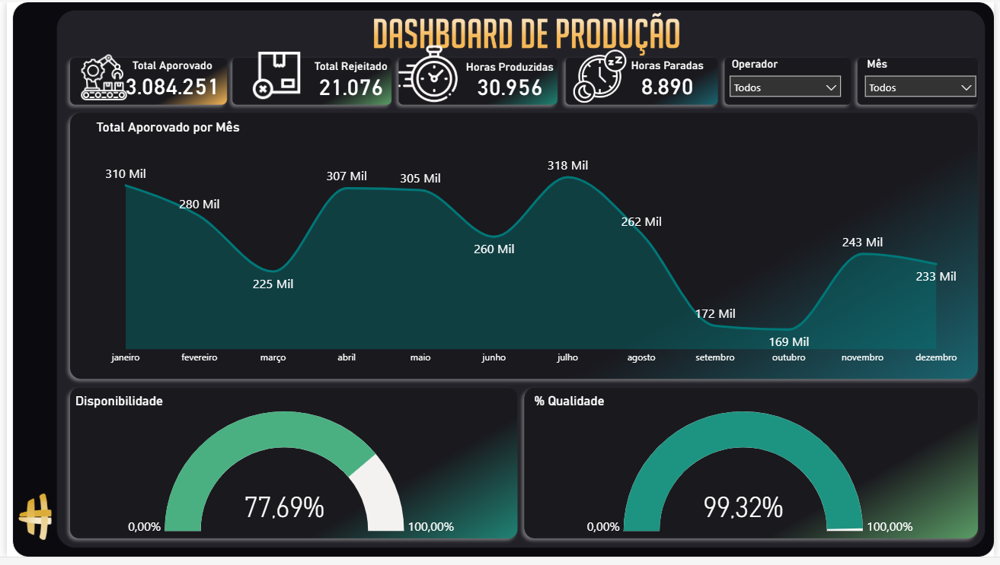

# 📊 Dashboard de Produção

---

## 📌 Sobre o Projeto

Este projeto apresenta um dashboard de produção desenvolvido no Power BI utilizando Excel como fonte de dados.

O objetivo é analisar indicadores operacionais e fornecer uma visão clara da performance produtiva.

---

## 📊 Indicadores analisados

✔ Total aprovado  
✔ Total rejeitado  
✔ Horas produzidas  
✔ Horas paradas  
✔ Produção mensal  
✔ Disponibilidade  
✔ Índice de qualidade  

---

## 🖼️ Preview do Dashboard

---

## 🛠 Ferramentas utilizadas

- Power BI
- Excel
- Modelagem de dados

---

## 👨‍💻 Autor

Marcos David  
Estudante de Análise e Desenvolvimento de Sistemas
